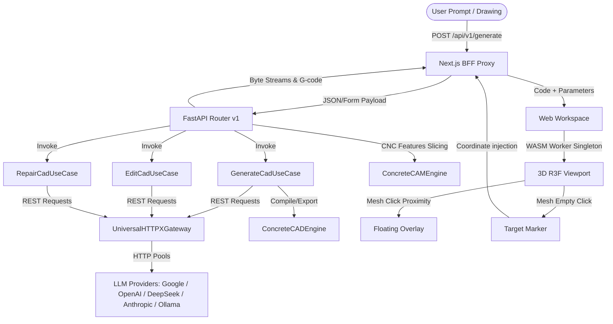

# 📐 CADVΞX — Multi-Vendor AI Parametric CAD Workstation

[](https://fastapi.tiangolo.com)
[](https://nextjs.org)
[](https://react.dev)
[](https://threejs.org)
[](https://prisma.io)

CADVEX is an advanced, production-grade AI-assisted CAD workstation that compiles natural language prompts, hand-drawn sketches, and 2D engineering blueprints (PDF/Image) directly into precise, parameterized 3D design models. 

By pairing **multi-vendor LLM reasoning engines (Google, OpenAI, DeepSeek, Anthropic, and local Ollama)** with a **client-side WebAssembly OpenSCAD compilation kernel**, CADVEX enables engineers to generate, inspect, and surgically edit CAD models in real time without heavy server dependencies.

---

## ⚡ Core Philosophy & Capabilities

Traditional CAD workflows require intensive manual drafting, while standard text-to-3D generators output un-editable, dense triangle meshes. CADVEX approaches 3D modeling as **Parametric Code Synthesis** (using OpenSCAD code blocks). It generates human-readable, mathematically exact, and easily adjustable engineering code.

### 🔍 1. Multimodal Blueprint Auditing
Upload an engineering drawing, blueprint (multi-page PDF/PNG/JPEG), or sketch. The backend parses the visual data, extracts coordinate structures, feature dimensions, and tolerances, returning a structured JSON feature map. All visual audits are stored in an **MD5-keyed caching database** to bypass redundant visual API calls.

### 🌐 2. Client-Side WASM OpenSCAD Kernel
All 3D rendering happens directly in the user's browser. Utilizing a global singleton WebAssembly worker instance (compiled from OpenSCAD via `openscad-wasm` v0.0.4), CADVEX compiles code changes and returns 3D STL geometry instantly in the browser. This eliminates rendering roundtrips and scales without server-side rendering costs.

### 📐 3. Proximity-Based "Quick Edit"
Click directly on cylindrical walls, circular holes, or planar faces of the 3D viewport. The viewport runs a spatial proximity algorithm matching the click coordinate to parameter ranges:
* **Hierarchical Matrix Parsing**: An in-browser sequential tokenizer and `Matrix4` stack parser walks the OpenSCAD syntax to resolve nested rotations and translations. This guarantees that dimension overlays (such as diameter rings and height lines) map perfectly to physical CAD features, even on rotated branches (like in a T-pipe).
* **Diameters / Cylinders**: Shortest distance from selection to the infinite central axis line minus the feature's radius.
* **Heights / Extrusions**: Point-to-plane distance along the extrusion direction to the top or bottom flat faces.
Matches spawn a premium floating editor canvas directly inside the viewport for instant adjustments.

### 📍 4. Spatial Target Context Injection
Drop a glowing visual crosshair marker anywhere on the empty 3D model surface. The coordinates are added as a spatial target attachment chip in the chat composer. When you send a message (e.g. *"add a screw boss here"*), these absolute `[x, y, z]` coordinates are silently sent as system context, positioning the AI's edit right at the clicked spot.

### 💾 5. Zero Local Output Persistence
CAD assemblies and DXF blueprints are generated in memory and served as byte streams (`StreamingResponse`), eliminating server-side file system pollution, volume bloat, and file storage synchronization issues.

---

## 🏗️ System Architecture

CADVEX splits roles cleanly between backend AI intelligence, local CAD/CAM compilers, and client-side execution:



### 🐍 Backend Clean Architecture Layout (`/backend`)
The backend is structured under a strict Layered Architecture layout:
* **`app/domain/`**: Pure entities (`ModelMetadata`, `Session`, `HistoryItem`) and contracts (`ISessionRepository`, `ILLMProviderGateway`, `ICADEngine`, `ICAMEngine`).
* **`app/application/`**: Interactors (`GenerateCadUseCase`, `EditCadUseCase`, `RepairCadUseCase`) executing prompts, code normalization, and cascading fallbacks.
* **`app/infrastructure/`**: Concrete adapters (`UniversalHTTPXGateway` connection pool, `PrismaSessionRepository` mock log, and `cad/` engines wrapping `build123d` and OpenCascade `OCP`).
* **`app/presentation/`**: Controller endpoints (`presentation/v1/router.py`) customized with a premium Monokai dark mode Swagger docs configuration.

### ⚛️ Frontend Next.js Workspace (`/frontend`)
The client interface is built using Next.js 16 (App Router), React 19, TailwindCSS v4, and Prisma ORM:
* **`app/`**: Workspace routing handlers and API proxies.
* **`components/`**: Monaco code editor wrapper, properties sidebar, chat dialogue, and Three.js / React Three Fiber CAD canvas.
* **`workers/`**: Singleton background WebAssembly OpenSCAD workers.
* **`prisma/`**: PostgreSQL database connector schemas (`schema.prisma` mapping User, Session, and HistoryItem records).

---

## 💾 Volume and Storage Management

To prevent anonymous volume leakage and disk bloat, development caching uses named Docker volumes:
* `cadvex_postgres_data` / `cadvex_postgres_data_prod`: Stores PostgreSQL database tables and structures.
* `cadvex_backend_venv`: Caches python virtual environments inside the development container.
* `cadvex_backend_pycache`: Caches compiled python bytecode.
* `cadvex_backend_logs` / `cadvex_backend_logs_prod`: Exposes and persists transaction log files (`/app/logs/prisma_repository.log`) on the host system.
* `cadvex_frontend_node_modules`: Caches node library dependencies.
* `cadvex_frontend_next`: Caches Next.js build chunks.

---

## 🚦 Getting Started

### 1) Run with Docker (Recommended)

#### Development Mode (With Hot Reloading)
1. Configure your `.env` files in `/backend/.env` and `/frontend/.env`.
2. Spin up the containers:
   ```bash
   docker compose up --build
   ```
3. Open `http://localhost:3000` to start editing. Code edits in `/backend` or `/frontend` will trigger live reloads.

#### Production Mode (Optimized & Secure)
1. Run the production-targeted orchestration:
   ```bash
   docker compose -f docker-compose.prod.yml up --build -d
   ```
This automatically runs database migrations (`db-migrate`) before spawning the optimized standalone Next.js client (`frontend`) and the production-ready FastAPI backend (`backend`).

---

### 2) Run Manually (Local Host)

#### Prerequisites
* **Node.js 20+**
* **Python 3.13+**
* **Docker Desktop** (For PostgreSQL database container)

#### Step 1: Database Setup
Start the local PostgreSQL container from the root directory:
```bash
docker compose up postgres -d
```

#### Step 2: FastAPI AI Backend Setup
Configure the environment and dependencies:
```bash
cd backend
cp .env.example .env  # Configure your model keys
python -m venv .venv
# Activate venv:
# Windows (PowerShell): .venv\Scripts\Activate.ps1
# macOS/Linux: source .venv/bin/activate
pip install -r requirements.txt
uvicorn app.main:app --reload --host 127.0.0.1 --port 8000
```

#### Step 3: Next.js Frontend Setup
Initialize database schemas and start the development server:
```bash
cd ../frontend
cp .env.example .env
npm install
npm run prisma:generate
npm run prisma:push
npm run dev
```
Navigate to `http://localhost:3000` to start editing.
