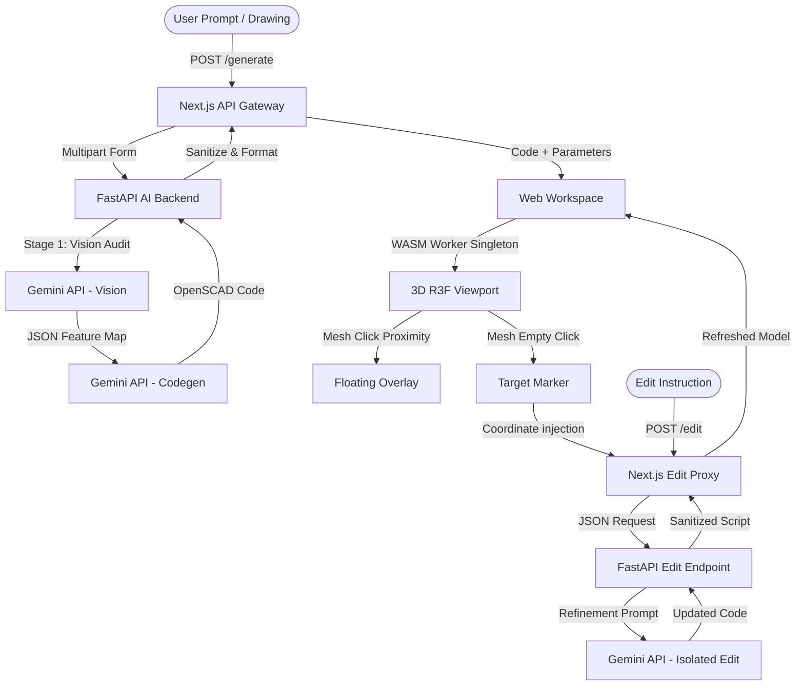

# 📐 CADVΞX

[](https://fastapi.tiangolo.com)
[](https://nextjs.org)
[](https://threejs.org)
[](https://ai.google.dev)

CADVEX is a state-of-the-art, AI-assisted CAD workstation designed to bridge the gap between natural language/drawings and parameterized 3D design models. By pairing **Google's Gemini multimodal LLM engine** with a **client-side WebAssembly OpenSCAD compilation kernel**, CADVEX allows engineers to generate, visualize, and surgically edit CAD code in real time without heavy server dependencies.

 *(For visualization purposes only)*

---

## ⚡ Core Philosophy & Capabilities

Traditional CAD workflows require intensive manual drafting, while standard text-to-3D generators output un-editable, dense triangle meshes. CADVEX approaches 3D modeling as **Parametric Code Synthesis**. It generates human-readable, mathematically exact, and easily adjustable code.

### 🔍 1. Multimodal Blueprint Audit
Upload an engineering drawing, drawing blueprint (multi-page PDF/PNG/JPEG), or a hand-drawn sketch. The backend uploads drawing files via the **Gemini Files API** and parses feature structures using an **MD5-keyed caching database**. This caches Stage 1 vision audits, speeding up subsequent edits and generations by ~10 seconds.

### 🌐 2. Browser-Local WASM Kernel
All 3D rendering happens directly on the client. Enforcing a global singleton WebAssembly worker instance (compiled from OpenSCAD), CADVEX processes changes and returns 3D STL geometry instantly in the browser. This setup eliminates rendering roundtrips, scales without server cost, and operates sandboxed.

### 📐 3. Proximity-Based "Quick Edit"
Click directly on cylindrical walls, circular holes, or planar faces of the 3D mesh. The viewport runs a spatial proximity algorithm matching the click coordinate to parameter ranges:
* **Hierarchical Matrix Parsing**: An in-browser sequential tokenizer and `Matrix4` stack parser walks the OpenSCAD syntax to resolve nested rotations and translations. This guarantees that dimension overlays (such as diameter rings and height lines) map perfectly to physical CAD features, even on rotated branches (like in a T-pipe).
* **Diameters / Cylinders**: Shortest distance from selection to the infinite central axis line minus the feature's radius.
* **Heights / Extrusions**: Point-to-plane distance along the extrusion direction to the top or bottom flat faces.
Matches spawn a premium, glassmorphic in-canvas overlay showing all parameters concurrently, transitioning to a detailed auto-focused label upon hover or select.

### 📍 4. Spatial Target Context Injection
Drop a glowing visual crosshair marker anywhere on the empty 3D model surface. The coordinate coordinates are added as a spatial target attachment chip in the chat composer. When you send a message (e.g. *"add a screw boss here"*), these absolute `[x, y, z]` coordinates are silently sent as system context, positioning the AI's edit right at the clicked spot.

### 🗺️ 5. Automated 4-View technical Drawings
Convert 3D assemblies into 2D vector drawings (DXF). The app implements safety projection wrappers that automatically generate standard engineering views (Top, Front, Right, and Isometric) in a single sheet.

---

## 🏗️ System Architecture

CADVEX split roles cleanly between backend AI intelligence and client-side execution:



---

## 🚦 Getting Started

### 1) Run Instantly with Docker (Recommended)

You can run the entire workstation stack locally in development or production mode using multi-stage Docker configurations.

#### Development Mode (With Hot Reloading)
1. Configure your `.env` in the root or set environment variables:
   ```bash
   GOOGLE_API_KEY=your_key_here
   ```
2. Spin up the containers:
   ```bash
   docker compose up --build
   ```
3. Open `http://localhost:3000` to start editing. Code edits in `/backend` or `/frontend` will trigger live reloads.

#### Production Mode (Optimized & Secure)
1. Run the production-targeted orchestration:
   ```bash
   docker compose -f docker-compose.prod.yml up --build -d
   ```
This automatically runs database migrations (`db-migrate`) before spawning the optimized standalone Next.js client (`frontend`) and the production-ready FastAPI backend (`backend`).

---

### 2) Run Manually (Local Host)

#### Prerequisites
- **Node.js 20+**
- **Python 3.11+**
- **Docker Desktop** (For PostgreSQL database container)

#### Step 1: Database Setup
Start the local PostgreSQL container from the root directory:
```bash
docker compose up postgres -d
```

#### Step 2: FastAPI AI Backend Setup
Configure the environment and dependencies:
```bash
cd backend
cp .env.example .env  # Add GOOGLE_API_KEY=your_key
python -m venv .venv
# Activate venv:
# Windows (PowerShell): .venv\Scripts\Activate.ps1
# macOS/Linux: source .venv/bin/activate
pip install -r requirements.txt
uvicorn app.main:app --reload --host 127.0.0.1 --port 8000
```

#### Step 3: Next.js Frontend Setup
Initialize database schemas and start the development server:
```bash
cd ../frontend
cp .env.example .env
npm install
npm run prisma:generate
npm run prisma:push
npm run dev
```
Navigate to `http://localhost:3000` to start editing.

---

## 🚀 Future Roadmap

We are expanding CADVEX into a comprehensive, production-grade engineering platform. The following features are currently planned:

* **[x] Native STEP Export**: Integrate python-based OpenCASCADE / FreeCAD rendering pipelines on the backend to allow downloading exact B-Rep STEP models alongside standard STL meshes.
* **[/] Slicing & G-Code Integration**: Direct client-side integration of lightweight slicing algorithms to allow generating 3D printing paths (G-code) directly from the parametric canvas.
* **[ ] CNC Toolpath Previews**: Output post-processed G-code optimized for 3-axis CNC milling operations directly from the subtractive metadata.
* **[ ] Offline LLM Support**: Support running local code models (e.g. Qwen-Coder or Llama-3-Coder) via Ollama, enabling offline CAD generation and secure parameter processing.
* **[ ] Hierarchical Assembly Constraints**: Bind multiple generated parts together using rigid joints, cylindrical constraints, and mechanical mates inside the 3D viewport.
* **[ ] Automated Tolerance Auditing**: AI checks matching parts for tolerances, interference fits, and mechanical clearances.
